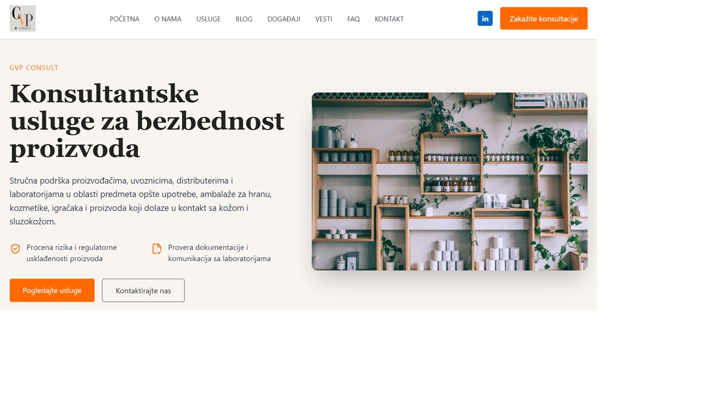
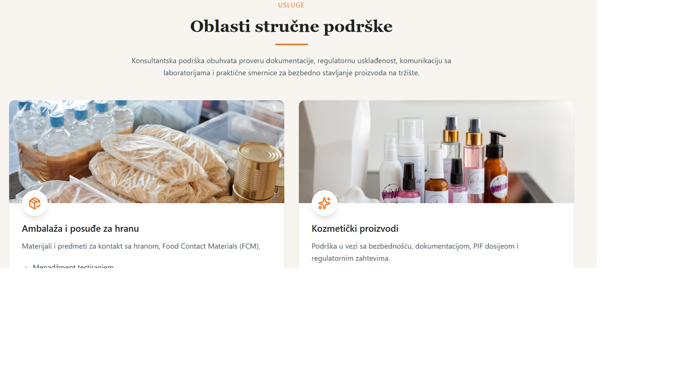
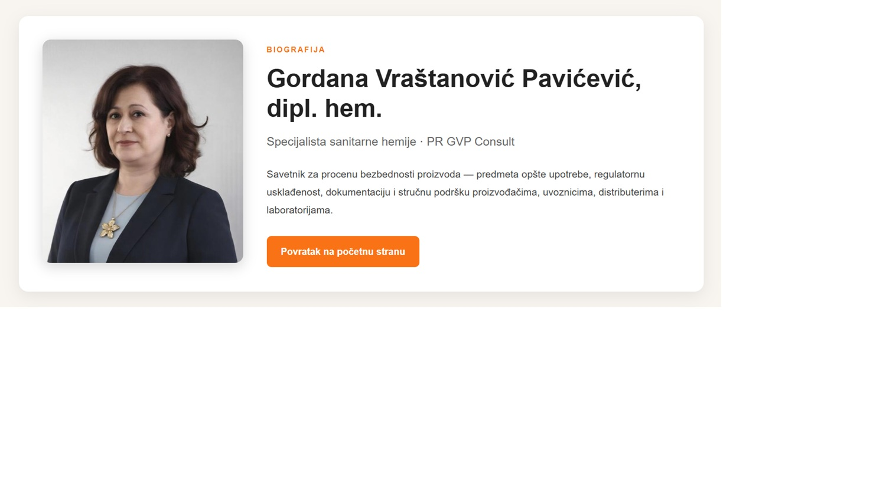

# GVP Consult

Professional consulting website for GVP Consult.

## Screenshots

### Homepage

### Services

### Biography

### Mobile Version

## About

GVP Consult provides consulting services in:

- Food Contact Materials (FCM)
- Cosmetic Products
- Toys
- Products in Contact with Skin and Mucous Membranes
- Testing Laboratories
- Regulatory Compliance
- Declarations of Conformity (DoC)
- Product Information File (PIF)

---

## Tech Stack

- Vue 3
- Vite
- Tailwind CSS
- Lucide Vue
- Cloudways Hosting

---

## Features

- Responsive Landing Page
- Biography Page
- Professional Blog
- Educational Articles
- Services Overview
- Contact Section
- Responsive Navigation

---

## Project Structure

src/
components/
assets/

public/
blog/
images/
biografija.html

---

## Current Status

Preview Version

Implemented:

- Hero
- About
- Services
- Events
- Blog
- Biography
- Responsive Header
- Mobile Navigation

---

## Planned

- Vue Router
- Blog CMS
- SEO optimization
- Structured Data
- LinkedIn integration
- AI Assistant
- Contact Form Backend

---

## Repository

https://github.com/RadojeBozic/gvp-consult

---

## Author

Express Web

https://express-web.express